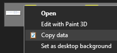

# Copy Data
Copy Data creates a context menu option on Windows Explorer that copies the content (text, image, etc) of a file to the clipboard without opening the file.

It does not copy the file or the file name/path, it copy it's actual contents.

In case of images, these can be directly pasted to applications that support it such as the ones with WYSIWYG editors (GMail, Slack, Outlook, etc.) or to image editing software (Paint, Paint.NET, etc.).

In case of text files, the contents can be pasted in any text or word processor, email bodies, etc.

Supported formats:
Images: .bmp, .gif, .jpg, .png, .tiff
Text: .bat, .cmd, .css, .html, .js, .reg, .txt, .vbs, .rtf (Will not work for .rtf files if "Office Word" is the default app instead of "Wordpad").

Aside from files ending in these extensions, the option won't show in the context menu (Windows Explorer shell). After installed, it looks like this:

The only thing created in Windows Start menu is an uninstaller link, so skip that if you don't want clutter. You can always uninstall through "Add or Remove Programs".

This is tested on Windows 10 only, but might work with Windows 8.1, 8 and possibly earlier versions.
The current version supports Windows 64-bit distributions only.

If you want support for other extensions, please create a new issue (look if it doesn't already exists first).
If you want to contribute to the project, just make a pull request.

Author's website: http://www.pplupo.com
